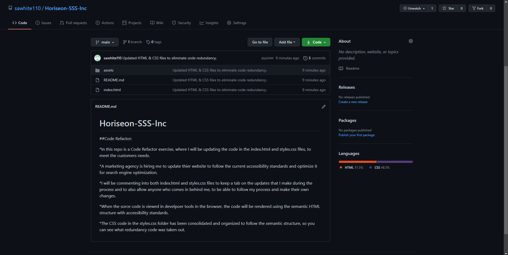
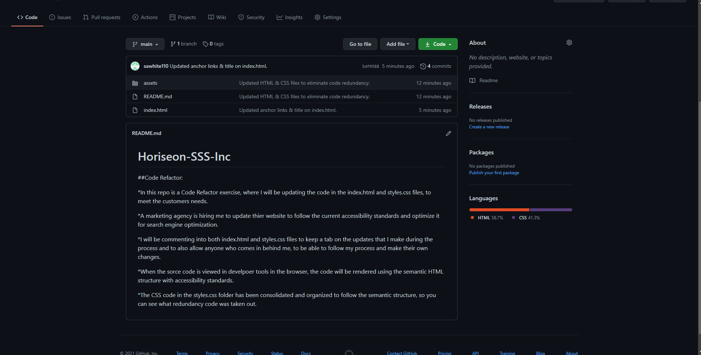
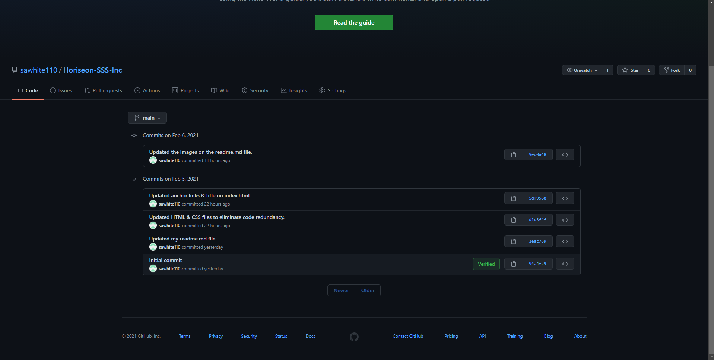

# Horiseon-SSS-Inc

## Code Refactor:

* This repo is a Code Refactor exercise, where I will be updating the code in the index.html and styles.css files, to meet the customers needs. I will also make accounts and a brief summary of the work in this readme.md file.

* A marketing agency is hiring me to update thier website to follow the current accessibility standards and optimize it for search engine optimization.

* I will be commenting into both index.html and style.css files to keep a tab on the updates that I make during the process and to also allow anyone who comes in behind me, to be able to follow my process and make their own changes.

* When the sorce code is viewed in develpoer tools in the browser, the code will be rendered using the semantic HTML structure with accessibility standards.

* The CSS code in the styles.css folder has been consolidated and organized to follow the semantic structure, so you can see what redundancy code was taken out.

## Screenshots of GitHub Commits

* Below is a git commit to read, “Updated HTML & CSS files to eliminate code redundancy.”

* Below is another git commit to read, “Updated anchor links & title on index.html.”

* Below is a screenshot of one other git commit I have uplaoded t GitHub, before the site goes live. The commit reads, "Updated the images on the readme.md file".

* The readme.md, index.html, and style.css files are update and uplaoded to GitHub.

* My last step in this process is to render my page live on the internet, using GitHub Pages as the host server.
